<div align="center">


<br/>


<br/>

**"The eyes of the Zeitgeist. See everything. Understand everything."**

*A real-time intelligence workbench for the [Zeitgeist](https://github.com/gabrielmaialva33/zeitgeist) platform — 11 views, live WebSocket feeds, geospatial maps, knowledge graphs, and predictive analytics. All in a single dark interface built for analysts.*

<br/>

> [!IMPORTANT]
> This is the **frontend layer** of the Zeitgeist intelligence platform. It requires the **[Zeitgeist backend](https://github.com/gabrielmaialva33/zeitgeist)** running on `http://localhost:4000` to function. The backend is a Gleam/BEAM application providing REST API and WebSocket streams.

</div>

---

## ⚡ Quick Start

```bash
# Clone
git clone https://github.com/gabrielmaialva33/zeitgeist-dashboard.git
cd zeitgeist-dashboard

# Install dependencies
npm install

# Run in development mode
npm run dev    # http://localhost:3000
```

```bash
# Make sure the Zeitgeist backend is running first
# https://github.com/gabrielmaialva33/zeitgeist
gleam run    # backend on http://localhost:4000
```

```bash
# Build for production
npm run build
npm start
```

---

## 🏗️ Architecture

```mermaid
%%{init: {'theme': 'dark', 'themeVariables': {'primaryColor': '#e94560', 'primaryTextColor': '#fff', 'primaryBorderColor': '#e94560', 'lineColor': '#8892b0', 'secondaryColor': '#1a1a2e', 'tertiaryColor': '#16213e', 'edgeLabelBackground': '#0d1117'}}}%%
graph TD
    A[👁️ Zeitgeist Dashboard] -->|REST + TanStack Query| B[🌐 Zeitgeist API :4000]
    A -->|WebSocket /ws/events| C[📡 Real-time Event Stream]
    B --> D[🧠 Knowledge Graph Engine]
    B --> E[⚠️ Risk Engine / CII]
    B --> F[🎭 Swarm Simulation]
    B --> G[🔮 Prediction Engine]
    C --> A
    D -->|Entity + Facts| A
    E -->|Risk Scores| A
    F -->|Agent States| A
    G -->|Predictions| A

    A --> H[🗺️ Map View / deck.gl]
    A --> I[🕸️ Graph View / D3]
    A --> J[📊 Charts / ApexCharts]

    style A fill:#0f3460,stroke:#e94560
    style B fill:#1a1a2e,stroke:#e94560
    style C fill:#16213e,stroke:#e94560
    style D fill:#1a1a2e,stroke:#e94560
    style E fill:#16213e,stroke:#e94560
    style F fill:#0f3460,stroke:#e94560
    style G fill:#1a1a2e,stroke:#e94560
    style H fill:#16213e,stroke:#8892b0
    style I fill:#16213e,stroke:#8892b0
    style J fill:#16213e,stroke:#8892b0
```

<div align="center">



</div>

The dashboard is a **Next.js 16 App Router** application. Each view connects to a dedicated backend engine via TanStack Query for REST and native WebSocket for real-time streams. Zero polling — everything is push-based.

---

## 👁️ 11 Intelligence Views

| View | Icon | Description | Status |
|:-----|:----:|:------------|:------:|
| **Briefing** | 📋 | Daily intelligence summary — top events, risk highlights, prediction accuracy | ✅ Live |
| **Events** | ⚡ | Real-time global event feed with filters by source, category, and severity | ✅ Live |
| **Risk** | ⚠️ | Country Instability Index (CII) heatmap — 14 correlation patterns, theater postures | ✅ Live |
| **Map** | 🗺️ | Geospatial layer built on deck.gl + MapLibre — events, military movements, ADS-B | ✅ Live |
| **Graph** | 🕸️ | D3-force knowledge graph — entities, relations, temporal decay visualization | ✅ Live |
| **Alerts** | 🔔 | High-severity alert stream with priority triage and acknowledgment workflow | ✅ Live |
| **Agents** | 🤖 | Swarm agent monitor — view active BEAM process agents, personality, decisions | ✅ Live |
| **Simulations** | 🎭 | World simulation control panel — spawn, inspect, and compare parallel scenarios | ✅ Live |
| **Predictions** | 🔮 | Prediction portfolio — active forecasts, confidence scores, validation status | ✅ Live |
| **Theater** | 🎯 | Strategic theater assessment — military posture, strike capability thresholds | ✅ Live |
| **Settings** | ⚙️ | API key config, WebSocket endpoint, theme, notification preferences | ✅ Live |

---

## 🛠️ Tech Stack

| Category | Technology | Version | Purpose |
|:---------|:-----------|:--------|:--------|
| **Framework** | Next.js | 16.1.6 | App Router, SSR, API routes |
| **UI Runtime** | React | 19.2 | Component model |
| **Language** | TypeScript | 5.9 | Type safety |
| **Styling** | Tailwind CSS | 4.x | Utility-first CSS |
| **Component Kit** | Metronic | v9.4.6 | Enterprise UI system |
| **Maps** | deck.gl + MapLibre | 9.2 / 5.21 | GPU-accelerated geospatial |
| **Graph** | D3 + d3-force | 7.9 | Force-directed knowledge graph |
| **Data** | TanStack Query | 5.85 | Server state, caching, refetch |
| **Charts** | ApexCharts + Recharts | 4.7 / 2.15 | Time series, heatmaps |
| **Real-time** | WebSocket (native) | — | Event stream from BEAM |
| **Animation** | Motion | 12.x | Transitions, live indicators |
| **Forms** | React Hook Form + Zod | 7.68 / 4.x | Validated config forms |
| **DnD** | dnd-kit | 6.3 | Draggable dashboard panels |

---

## 🎨 Color System — The Intelligence Palette

| Token | Hex | Usage |
|:------|:----|:------|
| `--color-void` | `#0d1117` | Page background — absolute dark |
| `--color-deep` | `#1a1a2e` | Card/panel background |
| `--color-layer` | `#16213e` | Secondary surfaces, borders |
| `--color-surface` | `#0f3460` | Elevated panels, hover states |
| `--color-signal` | `#e94560` | Primary accent — alerts, CTA, active |
| `--color-muted` | `#8892b0` | Secondary text, descriptions |
| `--color-live` | `#00C853` | Live indicators, confirmed predictions |
| `--color-warn` | `#FF6B35` | Elevated risk, warnings |
| `--color-critical` | `#FF1744` | Critical alerts, theater escalation |

---

## 📐 Project Structure

```
zeitgeist-dashboard/
├── app/
│   ├── (dashboard)/          # 11 intelligence views
│   │   ├── briefing/
│   │   ├── events/
│   │   ├── risk/
│   │   ├── map/
│   │   ├── graph/
│   │   ├── alerts/
│   │   ├── agents/
│   │   ├── simulations/
│   │   ├── predictions/
│   │   ├── theater/
│   │   └── settings/
│   ├── (layouts)/            # Layout variants
│   ├── api/                  # Next.js API routes
│   └── layout.tsx            # Root layout + providers
├── components/
│   ├── ui/                   # Metronic base components
│   └── screen-loader.tsx
├── hooks/                    # WebSocket, data hooks
├── lib/                      # API client, utils
├── providers/                # QueryClient, Theme, WS
├── config/                   # API endpoints, constants
└── styles/                   # Tailwind + intelligence palette
```

---

## 🖼️ Screenshots

> Screenshots coming soon. The dashboard runs fully dark with the intelligence palette above.

---

## 🔧 Development

```bash
npm run dev      # Dev server on :3000 with hot reload
npm run build    # Production build
npm run lint     # ESLint check
npm run format   # Prettier format
```

<details>
<summary><b>Environment Variables</b></summary>

```bash
# Required — Zeitgeist backend base URL
NEXT_PUBLIC_API_URL=http://localhost:4000

# WebSocket endpoint (defaults to same host)
NEXT_PUBLIC_WS_URL=ws://localhost:4000/ws/events

# Optional — API authentication key
NEXT_PUBLIC_API_KEY=your-secret-key

# Optional — map tile provider
NEXT_PUBLIC_MAP_STYLE=https://demotiles.maplibre.org/style.json
```

</details>

---

## 📜 License

MIT License — [Gabriel Maia](https://github.com/gabrielmaialva33)

---

<div align="center">


*"The dashboard doesn't just display data — it translates the noise of the world into signal."*

<br/>

**[gabrielmaialva33](https://github.com/gabrielmaialva33)**

</div>
